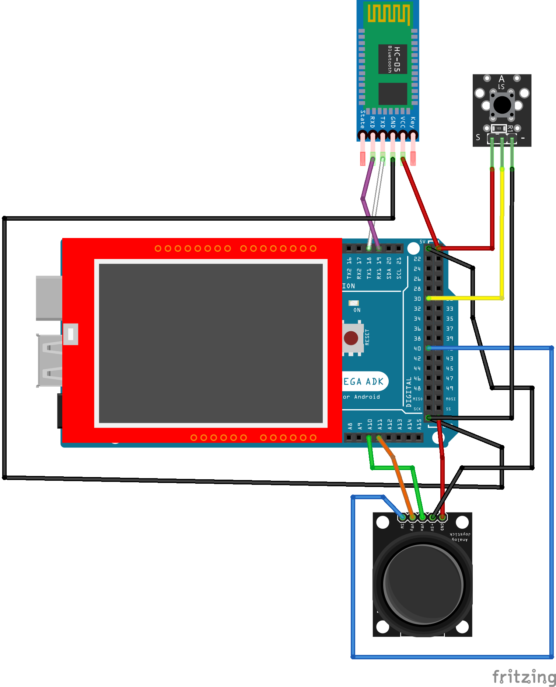
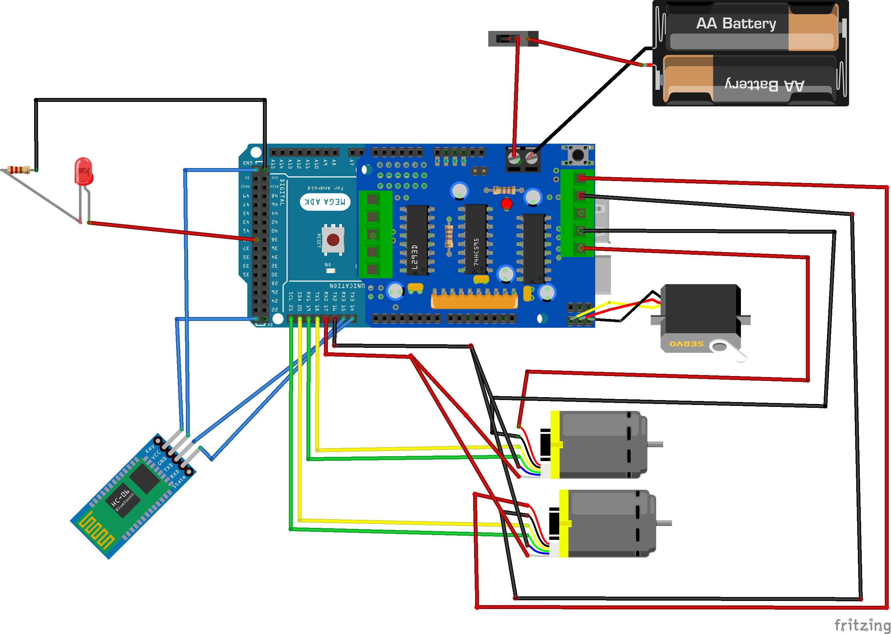

# 🚗 Projeto: Carrinho Robótico Arduino com Garra e Controle Remoto TFT

## 📖 Sobre o Projeto

Este repositório contém a documentação e os códigos para a montagem de um carrinho robótico customizado. O projeto une a versatilidade do **Arduino** com a mecânica do **LEGO**, resultando em um veículo capaz de se movimentar em todas as direções e manipular objetos através de uma garra articulada. O objetivo é colocar em uma pista para competir com outro carrinho feito por outro grupo com obstáculos feitos por ambos os grupos.

O diferencial do projeto é o seu **Controle Remoto Customizado**, que possui uma interface gráfica em um Display TFT, além de controle analógico via Joystick e botões de ação para a garra.

## ✨ Funcionalidades

* **Movimentação Omnidirecional/Tanque:** Tração gerada por 2 motores LEGO.
* **Manipulação de Objetos:** Garra frontal controlada de forma precisa por um Servo Motor.
* **Interface Visual:** Display TFT Shield no controle para exibir status (velocímetro, velocidade digital, bússola direcional, etc).
* **Controle Intuitivo:** Movimentação feita por um Joystick analógico.
* **Comunicação Sem Fio:** Conexão robusta via Bluetooth (Módulos HC-05).

---

## 🛠️ Lista de Componentes

### 🚙 Para o Carrinho (Receptor)
* 1x Placa Arduino
* 1x Driver de Motor
* 2x Motores LEGO
* 1x Servo Motor (para a garra)
* 1x Módulo Bluetooth HC-05 (Configurado como Slave)
* 1x Chassi
* 2x Baterias

### 🎮 Para o Controle Remoto (Transmissor)
* 1x Arduino Mega
* 1x Shield Display LCD TFT (encaixado diretamente no Mega)
* 1x Módulo Joystick Analógico (Eixos X, Y e Botão Z/SW)
* 1x Módulo Botão Push-button (Ação adicional)
* 1x Módulo Bluetooth HC-05 (Configurado como Master)
* Fios Jumper e Protoboard

---

## ⚡ Esquema de Ligação - Controle Remoto

Abaixo está o diagrama esquemático das conexões físicas do controle remoto, construído com base na imagem do Fritzing fornecida.

## ⚡ Esquema de Ligação - Carrinho

Abaixo está o diagrama esquemático das conexões físicas do controle remoto, construído com base na imagem do Fritzing fornecida.

### 📌 Tabela de Conexões (Pinagem)

| Componente | Pino do Componente | Pino no Arduino Mega | Observações |
| :--- | :--- | :--- | :--- |
| **Shield TFT** | - | - | Encaixado diretamente sobre a placa. |
| **Módulo Bluetooth** | VCC | 5V | Alimentação |
| **Módulo Bluetooth** | GND | GND | Aterramento |
| **Módulo Bluetooth** | TXD | RX1 (Pino 19) | Comunicação Serial 1 |
| **Módulo Bluetooth** | RXD | TX1 (Pino 18) | Comunicação Serial 1 |
| **Joystick** | +5V | 5V | Alimentação |
| **Joystick** | GND | GND | Aterramento |
| **Joystick** | VRx | A9 | Eixo X Analógico |
| **Joystick** | VRy | A10 | Eixo Y Analógico |
| **Joystick** | SW (Botão 1) | Pino Digital 40 | Botão embutido no direcional |
| **Módulo Botão** | VCC | 5V | Alimentação |
| **Módulo Botão** | GND | GND | Aterramento |
| **Módulo Botão** | S (Sinal/Botão 2)| Pino Digital 30 | Botão para ação da garra |

---

## 🚀 Como Funciona

1. **Leitura dos Comandos:** O Arduino Mega lê constantemente as portas analógicas conectadas ao Joystick (A9 e A10) para determinar a direção e velocidade desejada. Simultaneamente, lê o estado dos pinos digitais 30 e 26 correspondentes aos botões.
2. **Atualização da Interface:** As informações de movimento e o status da garra podem ser desenhados (conforme necessário) no Display TFT utilizando bibliotecas como a `MCUFRIEND_kbv` 
3. **Transmissão:** Os dados de leitura são formatados em um pacote (ex: uma string de caracteres ou array de bytes) e enviados pela Serial 1 (Pinos 18 e 19) para o módulo Bluetooth HC-05 Master.
4. **Recepção e Ação:** O carrinho, equipado com o HC-05 Slave, recebe esses comandos, traduz em sinais PWM para o Driver de Motor (movendo os motores LEGO) e define o ângulo do Servo Motor (abrindo/fechando a garra).

## 🔧 Próximos Passos
* [ ] Publicar vídeos do desenvolvimento no YouTube.
* [ ] Finalizar o upload de todos arquivos.

---
*Projeto desenvolvido por Abner, Rafael e Tiago.*
